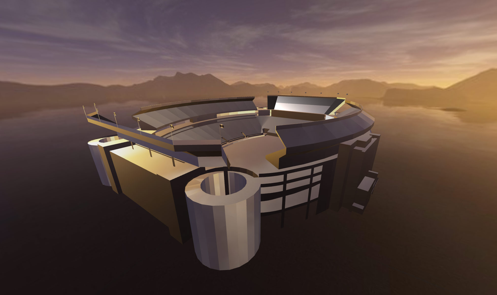
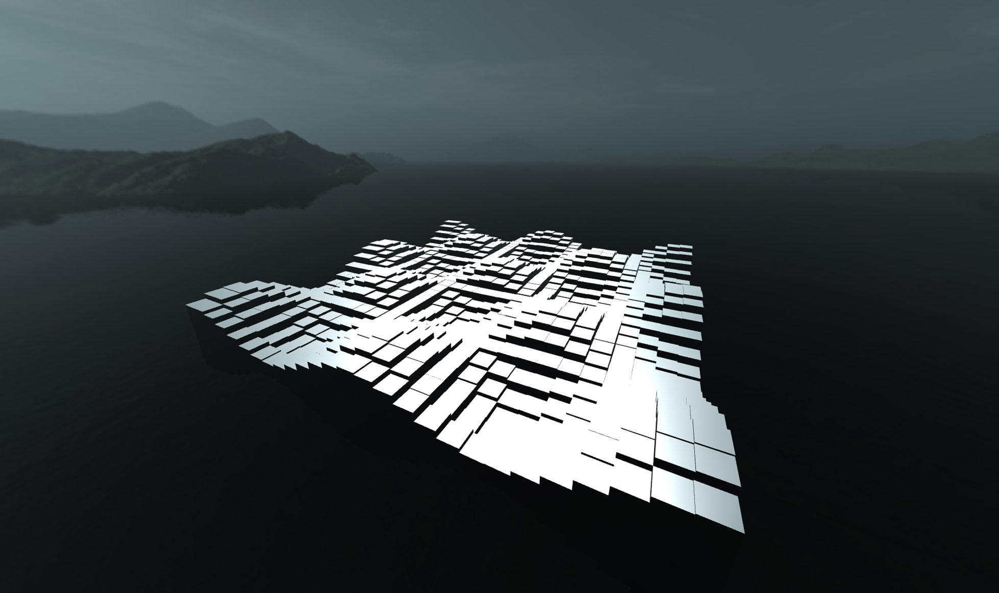
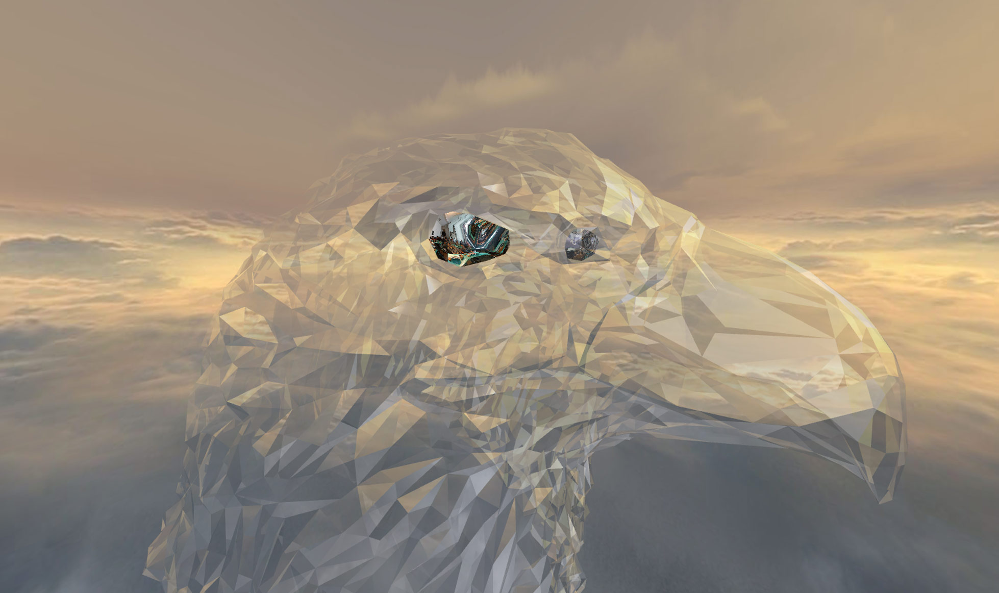
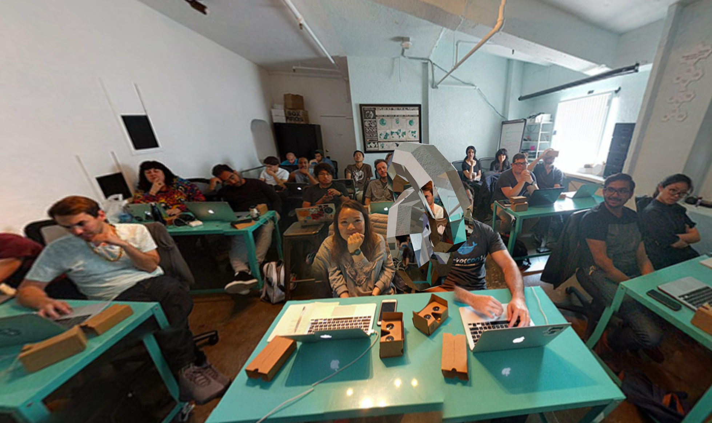

# [Building Virtual Reality Worlds using Three.js](http://grayarea.org/workshop/building-virtual-reality-worlds-using-three-js/)

[](http://classes.marpi.pl/worlds2/)

[](http://classes.marpi.pl/worlds2/public/stadium)

[](http://classes.marpi.pl/worlds2/public/wave)

[](http://classes.marpi.pl/worlds2/public/glass_eagle)

[](http://classes.marpi.pl/worlds2/public/class)

### How to run

In order to run the project you need a local server. You can use MAMP:

[https://www.mamp.info/](https://www.mamp.info/)

Or run Python's built-in http server.
In terminal, browse to the repo and run:

```sh
# Python 2.x
python -m SimpleHTTPServer
```

```sh
# Python 3.x
python -m http.server
```

And once you commit your changes, and want to see them in Google Cardboard:

[http://classes.marpi.pl/worlds2/](http://classes.marpi.pl/worlds2/)
